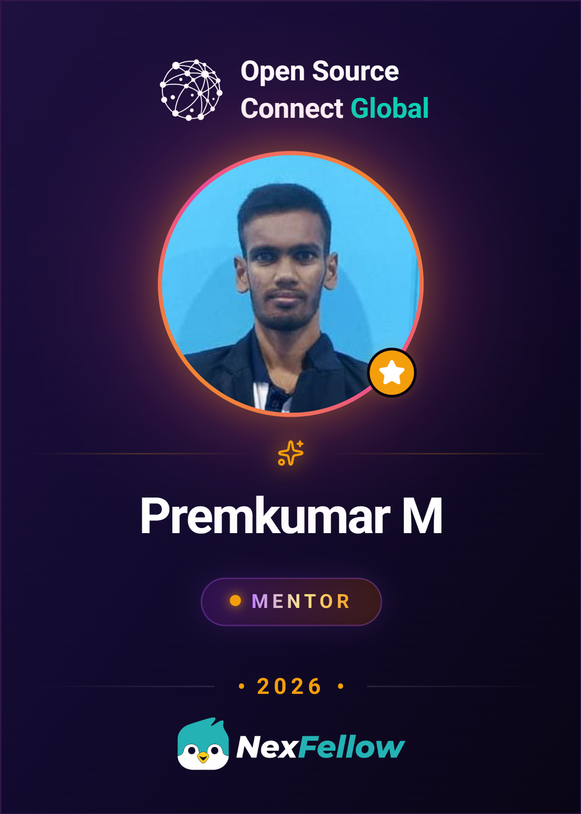

<!-- Animated Header -->

  <h3>Connect with me:</h3>
  

    
    
    
    
  

  

    
  

  

    
  

---

<table align="center" width="100%" style="border-collapse: collapse;">
  <tr>
    <td align="center" width="50%" valign="top">
      <h2>🚀 About Me</h2>
      

        I'm a passionate developer focusing on turning innovative ideas into market-ready solutions. I am the founder of <b><a href="https://www.sproutern.com">Sproutern</a></b>, a comprehensive platform offering 30+ free career tools, interview prep, and study abroad guides.  
        🔭 <b>Currently working on:</b> Scaling Sproutern's free resources globally 
        🌱 <b>Currently learning:</b> Next-Gen AI Integration & Web3 
        👯 <b>Looking to collaborate on:</b> Open Source & IoT Systems 
        💬 <b>Ask me about:</b> Node.js, Flutter, Robotics, AI Prompts 
        📫 <b>How to reach me:</b> <a href="mailto:premkumar@sproutern.com">premkumar@sproutern.com</a>
      

    </td>
    <td align="center" width="50%" valign="top">
      <h2>🏆 Achievements</h2>
      

        <ul>
          <li>🥉 <b>3rd Place – Synergy'24 (AUSEC MIT):</b> Innovation in Robotics & IoT.</li>
          <li>💼 <b>CFO – IGNITE Program:</b> AI-based fashion rental project.</li>
          <li>💻 <b>NFT Creator:</b> Sold NFTs generated via custom Stable Diffusion pipelines.</li>
          <li>🎓 <b>OSCG Mentor:</b> Mentoring developers in the Open Source Community Group.</li>
          <li>🌟 <b>Open-Source Contributor:</b> Sponsored for GitHub contributions.</li>
        </ul>
      

    </td>
  </tr>
</table>

---

## 🧰 Tech Stack & Skills

**Languages** 
       

**Frameworks, Libraries & Mobile** 
     

**Databases** 
  

**Tools & Platforms** 
      

---

## 🔥 Featured Projects

<table align="center" width="100%">
  <tr>
    <td width="50%" valign="top">
      <h3>🤖 <a href="https://github.com/itspremkumar">Ronbot – Humanoid Robot</a></h3>
      
An IoT-powered humanoid robot built with Arduino Mega and ESP32-CAM. Features remote control and real-time video streaming.

      <code>Arduino</code> <code>ESP32</code> <code>C++</code> <code>IoT</code>
    </td>
    <td width="50%" valign="top">
      <h3>🌾 <a href="https://github.com/itspremkumar">Farmers-to-Consumer Platform</a></h3>
      
A full-stack platform connecting farmers directly with consumers, featuring OTP-based login, real-time chat, and driver tracking.

      <code>Flutter</code> <code>Node.js</code> <code>Express</code> <code>MongoDB</code>
    </td>
  </tr>
  <tr>
    <td width="50%" valign="top">
      <h3>🎨 <a href="https://github.com/itspremkumar">AI/NFT Prompt Generator</a></h3>
      
An AI-powered tool that generates creative prompts for NFT art using highly optimized Stable Diffusion pipelines.

      <code>Python</code> <code>Stable Diffusion</code> <code>AI/ML</code>
    </td>
    <td width="50%" valign="top">
      <h3>📶 <a href="https://github.com/itspremkumar">Seamless Mobile IP Manager</a></h3>
      
A Java-based networking project architecture for seamless IP allocation and management in moving mobile networks.

      <code>Java</code> <code>Sockets</code> <code>Networking</code>
    </td>
  </tr>
</table>

---

## � Professional Experience & Ventures

### 🚀 [Sproutern](https://www.sproutern.com) (Founder & Creator)
*A platform democratizing career guidance with free tools, interview prep, and study abroad resources.*
- Built and scaled a platform providing over 30+ free career tools, including CGPA converters, resume score checkers, and salary calculators.
- Curating real interview experiences and comprehensive study abroad guides for students internationally.
- Committed to keeping high-quality career guidance and resources 100% free and accessible to everyone.

### 🌟 Open Source Community Group (Mentor)
*Guiding the next generation of passionate developers.*
- Mentoring aspiring developers in coding best practices, system design, and successful community participation in Open Source environments.
- Sharing hands-on experience covering Advanced Robotics (Arduino, ESP32) and AI Pipelines (Stable Diffusion).

---

## 💡 Quote of the Day

  

---

## �📊 GitHub Analytics

  
  

    

  

 

  <h3>🏆 GitHub Trophies</h3>
  

 

  <h3>⚡ Activity Graph</h3>
  

 

  <h3>🐍 GitHub Contribution Snake Animation</h3>
  <picture>
    <source media="(prefers-color-scheme: dark)" srcset="https://raw.githubusercontent.com/itspremkumar/itspremkumar/output/github-contribution-grid-snake-dark.svg">
    <source media="(prefers-color-scheme: light)" srcset="https://raw.githubusercontent.com/itspremkumar/itspremkumar/output/github-contribution-grid-snake.svg">
    
  </picture>

 

  

  <b>Happy Coding! 😊 Have a wonderful day!</b>

